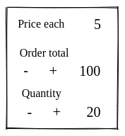

# Process flow using phantom types

Sometimes we want to create a process that needs to follow different paths until it reaches an end point. Like a finite state machine.

For example we want an order form where you can change the total or the quantity. When you change any of these two, the other value needs to change automatically.



- When the user updates the total we want to update the quantity
- When the user updates the quantity we want to update the total

These two flows can be illustrated with a state machine:


This is a simple example to illustrate this pattern. This particular example can be done with less ceremony, but in more complex scenarios this pattern is really valuable.

We want to design our code in way that:

- Enforces running through the process steps in the correct order (depending on the user intention)
- Doesn't let us forget a step

## Anti-pattern

One possible way of doing this is by creating intermediate types for our process:

```elm

type alias InvalidOrder =
	{ quantity : Maybe Int, total : Maybe Int }

type alias OrderWithQuantity =
	{ quantity : Int, total: Maybe Int }

type alias OrderWithTotal =
	{ quantity : Maybe Int, total: Int }

type alias Order =
	{ quantity : Int, total : Int }

setTotal : Int -> InvalidOrder -> OrderWithTotal

adjustQuantityFromTotal : OrderWithTotal -> Order

setQuantity : Int -> InvalidOrder -> OrderWithQuantity

adjustTotalFromQuantity : OrderWithQuantity -> Order
```

Although this is not too bad here, if we were to have more paths and attributes the multiplication of intermediate types would get out of hand really quickly.

## Pattern

**Phantom types** allow us to deal with this in an elegant way.

### State machine states

First we need some types to define the state machine states:

```elm
type Step step
    = Step Order

type Start
    = Start

type OrderWithTotal
    = OrderWithTotal

type OrderWithQuantity
    = OrderWithQuantity

type Done
    = Done
```

The `phantom type` here is in `Step`. Note how it defines a `step` type variable that is not used in the constructor.

### Transitions

Then we can create transition functions that use the phantom type to restrict what they take and return.

For example:

```
adjustQuantityFromTotal : Step OrderWithTotal -> Step Done
```

This function can only take a `Step` that is in the `OrderWithTotal` state. And returns a `Step` in `Done` state.

For our order state machine we need these functions:

```elm
setTotal : Int -> Step Start -> Step OrderWithTotal

adjustQuantityFromTotal : Step OrderWithTotal -> Step Done

setQuantity : Int -> Step Start -> Step OrderWithQuantity

adjustTotalFromQuantity : Step OrderWithQuantity -> Step Done

done : Step Done -> Order
```


These functions are state machine transitions. They only allow moving from specific states to other specific states.

### Flows

And finally we can build the valid flows using these functions:

```elm
flowPrioritizingTotal total order =
    Step order
        |> setTotal total
        |> adjustQuantityFromTotal
        |> done


flowPrioritizingQuantity quantity order =
    Step order
        |> setQuantity quantity
        |> adjustTotalFromQuantity
        |> done
```

In this way we can enforce specific processes without creating a myriad of intermediate types.

See a working example here <https://ellie-app.com/9SywZggd5m5a1>
